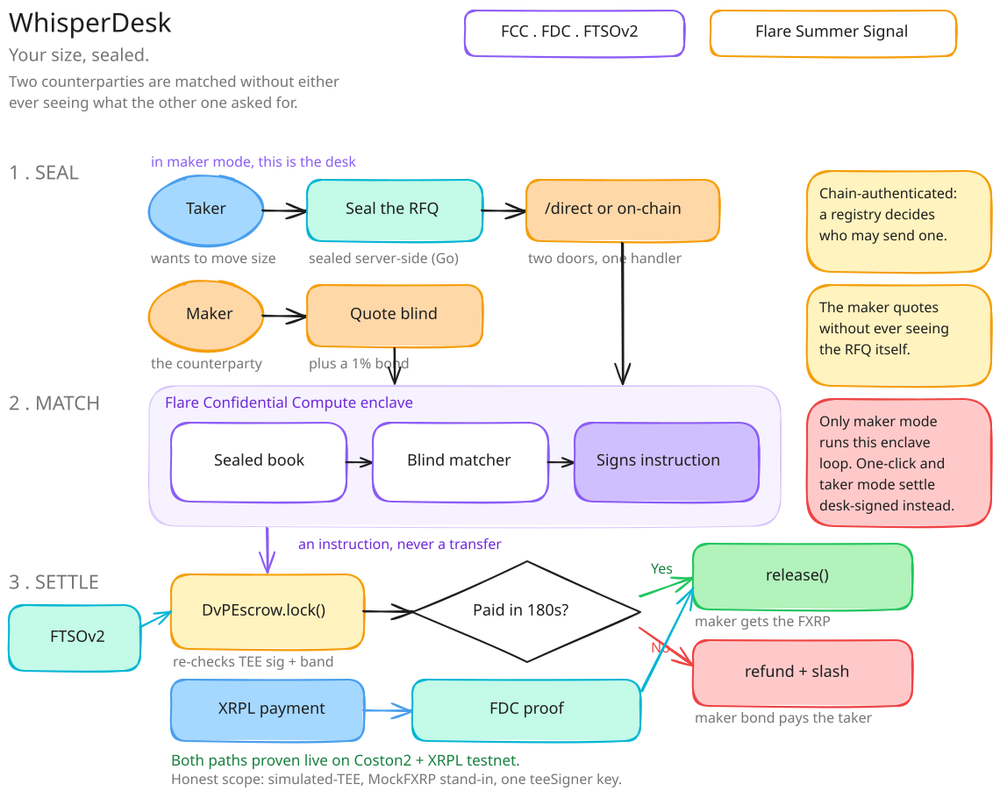

# Architecture

WhisperDesk splits into five layers. Only the top layer ever knows what a trade actually is —
everything below it just enforces rules against a signature and two proofs.

## 1. Browser console

The Next.js UI at [whisperdesk.endpx.cloud](https://whisperdesk.endpx.cloud) is where a
counterparty submits an RFQ or a quote. It never sees match logic — it only talks to one of the
two RFQ ingresses below, then watches the escrow's onchain state.

## 2. Two RFQ ingresses

| Ingress | Path | Taker identity | Used by |
|---|---|---|---|
| Onchain | `WhisperDeskInstructionSender.submitRfq` (`0x56A903F408C4745D34354Ec230BbfBDD78eC6426`) | Stamped from `msg.sender` — cannot be forged. The TEE registry enforces this contract as the only valid instruction origin for extension `65641`. | The chain-authenticated path — has settled end to end. |
| Direct | `POST /direct` (API-keyed, `WD_ALLOW_DIRECT_RFQ=true`) | Self-attested in the request envelope. | The website's one-click demo, which has to finish inside a browser session rather than wait on the auction window plus two extra onchain transactions. |

Both feed the same enclave, the same matching, and the same escrow logic downstream — the
difference is only how the taker's identity gets asserted going in.

## 3. FCC enclave

Hosted at [fce.endpx.cloud](https://fce.endpx.cloud/info), registered as extension `65641` with a
TEE machine at `PRODUCTION` status. Three things happen here, all RAM-only, never written to a
database or log:

- **Sealed order book** — RFQ side, size, limit, and the identity↔order mapping of the unmatched
  book exist only inside the enclave.
- **Blind matcher** — a deterministic Go matcher (`extension/matcher/`) crosses maker and taker
  orders without either side seeing the other's order before it fills.
- **Instruction signer** — once matched, the enclave signs a `MatchInstruction` (`WD_MATCH_V1`)
  with its own in-enclave key. Nothing downstream trusts the enclave's word for this — it checks
  `ecrecover == teeSigner`.

The enclave runs in **simulated-TEE** mode today (attestation `magic_pass`,
`SIMULATED_TEE=true`) — the mode Flare states is eligible for judging; GCP Confidential Space is
not required. The cost of that mode is a persistent identity: the signing key regenerates on
every restart by design, which is exactly what `scripts/enclave-loop/monitor.mjs` watches for.

## 4. Coston2 contracts

| Contract | Address |
|---|---|
| DvPEscrow — public one-click demo | `0x5f32783D629E2acBb83f16628ad76D02A26CFB9B` |
| DvPEscrow — enclave loop (`teeSigner` = the live enclave) | `0x20A885cb6ed3F652C5Fcb6a683CE74436F6a7023` |
| BondLedger | `0xC2f2F46A126E542E8178e2cc8fdC13aF3A48E156` |
| MockFXRP (mintable, 6 dec) | `0x700bfC3620585eb42F1Dda6aBA3Ac8E793859FBE` |
| Real FAssets FXRP (`FTestXRP`) | [`0x0b6A3645…3dc7`](https://coston2-explorer.flare.network/address/0x0b6A3645c240605887a5532109323A3E12273dc7) |

`lock()` re-checks the FTSOv2 price band and posts a 1% maker bond via `BondLedger`; `release()`
pays FXRP against an FDC proof bound to that exact escrow instance; `refund()` is permissionless
after `refundAfter + REFUND_GRACE` and slashes the bond to the taker.

The interactive demo settles against MockFXRP (mintable, unbacked) because the demo faucet has to
fund every visitor and the real asset can't be conjured per visitor. The mechanism itself is not
mock-bound — it has also settled once against the real FAssets-minted FXRP above, on a dedicated
escrow instance.

## 5. FTSOv2 / FDC / XRPL

| Service | Address | Role |
|---|---|---|
| FTSOv2 | `0xC4e9c78EA53db782E28f28Fdf80BaF59336B304d` | Read at `lock()` time to re-derive the required XRP drops and enforce a ±1% price band. |
| FdcVerification | `0x906507E0B64bcD494Db73bd0459d1C667e14B933` | Verifies the `XRPPayment` attestation `release()` consumes; a proof is bound to `proofOwner == address(this)`, so it can never be replayed against a different escrow. |
| XRPL Testnet | — | Where the actual maker→taker XRP payment happens; the FDC proof turns that payment into an onchain fact the escrow can act on. |

## Why the chain re-checks everything

The enclave is trusted for secrecy only — never with custody. It emits one signed instruction, and
Coston2 independently re-verifies every part of it that matters: `ecrecover == teeSigner`, the
FTSOv2 ±1% band recomputed onchain, an FDC proof of the actual XRPL payment bound to that one
escrow, deadlines, and bond slashing.

That split bounds the damage a compromised enclave can do:

- It can leak order flow — side, size, counterparty — because secrecy is the one thing it was ever
  trusted with.
- It **cannot** print an off-market trade, because `lock()` recomputes the price band itself
  rather than trusting whatever the enclave sent.
- It **cannot** move a token without a genuine XRPL payment, because `release()` only pays out
  against a real FDC proof scoped to that one escrow.

Worst case: confidentiality loss plus a fill at the edge of the band — bounded at **1% of
notional**, no fund theft possible.

## Which demo mode runs the full loop

> Not every "Try it" mode exercises the same amount of enclave.

- **Maker mode** — quoting blind against a sealed RFQ you cannot read — is the one path that runs
  the complete loop end to end: the RFQ is sealed (ECIES) into the live enclave, your quote is
  authenticated inside it by EIP-712, and the enclave itself matches the order and signs the
  `MatchInstruction` with its own key before the escrow will accept it.
- **One-click** (desk-held testnet keys, rate-limited) and **taker mode** (your own MetaMask, XRP
  lands on an address you control) settle against a **desk-signed instruction** over `POST
  /direct` instead — the same `WD_MATCH_V1` / `ecrecover` scheme and the same downstream escrow
  logic, but the RFQ arrives with a self-attested taker rather than waiting on the live enclave's
  blind match.

Everything downstream of either path — `lock()`, the FTSOv2 band check, the FDC-proven XRPL
payment, `release()` or `refund()` — is identical.
