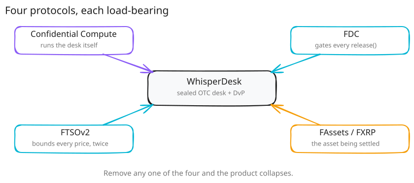

# Flare Integration

WhisperDesk is built on four Flare-native primitives, and each one carries load it cannot shed.
Remove any one and the design collapses back into a public order book or a custodial box.

- **[Flare Confidential Compute (FCC/FCE)](./fcc.md)** holds the secret order book — sealed RFQs
  are matched inside a live Coston2 enclave, and the unmatched book never touches a database, a
  log, or the mempool.
- **[Flare Data Connector (FDC)](./fdc.md)** gates the payout — `DvPEscrow.release()` pays FXRP to
  the maker only against a proof-bound FDC `XRPPayment` attestation, no exceptions.
- **[FTSOv2](./ftsov2.md)** bounds the price — XRP/USD is read once in-enclave and again onchain in
  `lock()`, so a compromised enclave can only fill at the edge of a ±1% band, never move a token.
- **[FAssets / FXRP](./fassets.md)** is the settlement asset itself — the public demo runs on a
  mock, but one full settlement has also cleared against the real, FAssets-minted FXRP.

Together, the enclave is trusted for secrecy only, never custody: every settlement rule is enforced
onchain regardless of what the enclave signs.
