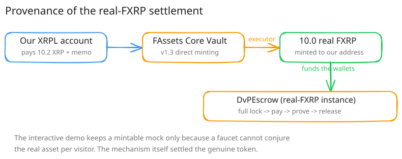

# FAssets / FXRP



_Part of [Flare Integration](./README.md)._

FXRP is the asset the whole DvP mechanism exists to move. Two things are true at once here, and both
are stated plainly rather than blended together:

- **The interactive demo settles genuine FAssets FXRP** (`FTestXRP`, 6 decimals) at
  `0x700bfC3620585eb42F1Dda6aBA3Ac8E793859FBE`. This exists because the public one-click demo needs a
  faucet that can hand every visitor FXRP on demand — the real, FAssets-minted asset cannot be
  conjured per visitor.
- **One full settlement has also run against the real FAssets-minted FXRP** — `AssetManagerFXRP.fAsset()`
  = [`0x0b6A3645…3dc7`](https://coston2-explorer.flare.network/address/0x0b6A3645c240605887a5532109323A3E12273dc7)
  (symbol `FTestXRP`, 6 decimals, same units as the mock) — on a dedicated escrow instance
  ([`0xfa0895ce…e087`](https://coston2-explorer.flare.network/address/0xfa0895ce6af9ef9764afbb967d822dadc13ae087)).

No `mint()` exists on the real asset. The team acquired it the way the protocol intends: a **v1.3
direct mint**, initiated by the team itself. 10.2 XRP went from the team's XRPL account to the
FAssets Core Vault with the 32-byte direct-minting memo, and the protocol's executor minted 10.0 FXRP
to the team's address (the 0.1 XRP executor fee is exactly what pays for that execution). The
settlement wallets were then funded by transfer from that real FXRP balance.

| Step | Receipt |
|---|---|
| XRPL payment → Core Vault (10.2 XRP, direct-minting memo) | https://testnet.xrpl.org/transactions/833E5C138006185960338AB0707768401E35AD2A53A203EDF2D076C473081AC0 |
| FAssets mint — 10.0 real FXRP to our address | https://coston2-explorer.flare.network/tx/0xfc5255afa0cadee272275fa018b3a21a0b6aa69b497f01cae622045c5eb55c4d |
| `lock()` on the real-FXRP escrow | https://coston2-explorer.flare.network/tx/0x874e167d710c04f1c670c779288f620003061dc9f808d5284bfeef0ba9cc7dbb |
| XRPL payment (1,000,000 drops, destination tag 1) | https://testnet.xrpl.org/transactions/9188C50DC94E3D3B314B5B99E5ABE4DB3585E1C926ABB3125542EA20B3490ADF |
| FDC attestation request (voting round 1414419) | https://coston2-explorer.flare.network/tx/0x7c990bea581a5aa0f1b01e63d689c6b1b7e150678bc0ee5a0c18655ca6325371 |
| `release()` — maker received 1.0 **real** FXRP | https://coston2-explorer.flare.network/tx/0x9ea70cafebbf0e6b937216af9cea374d798e6eb0466b7104fe40fd7e256aaea3 |

Reproduce it yourself:

```bash
FXRP_ADDRESS=0x0b6A3645c240605887a5532109323A3E12273dc7 \
  forge script script/DeployIntegration.s.sol --rpc-url coston2 --broadcast --slow
```

then point `happy-path.mjs` at the printed escrow.

> **Scope note on trade size.** Every trade you can run here — mock or real FXRP — is 1 FXRP, not an
> institutional block. The desk's canonical policy is a 5,000 FXRP minimum block (`MIN_BLOCK_FXRP`);
> the deployed integration instance overrides it to `1e6` (1 FXRP) because a 5,000-FXRP block needs
> ~5,000 XRP of counter-payment on the XRPL leg, and a faucet-funded XRPL testnet account cannot move
> that. Every receipt on this page is a 1-FXRP trade under that testnet-only override.
