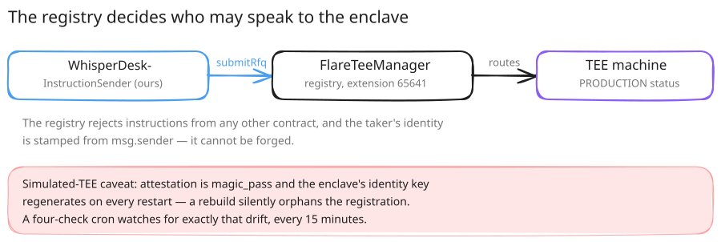

# Flare Confidential Compute (FCC/FCE)



_Part of [Flare Integration](./README.md)._

The desk itself runs inside a Flare Confidential Compute enclave (FCE) — this is where sealed RFQs
are matched and where side, size, limit price, and counterparty identity live for as long as an order
is unmatched. Nothing about the unmatched book touches a database, a log, or the mempool.

The extension is registered and running live on Coston2:

| Component | Address / URL |
|---|---|
| FCE `/info` (signed `TeeInfo`) | https://fce.endpx.cloud/info |
| FCE extension ID | `0x…010069` (65641) |
| WhisperDeskInstructionSender | `0x56A903F408C4745D34354Ec230BbfBDD78eC6426` |
| Live TEE signer | `0x56564F61588bB110E0712c3938aDa4338e6cc18B` |

The TEE machine backing the extension is registered and at `PRODUCTION` status, and
`WhisperDeskInstructionSender` is the **registry-enforced** instruction sender for extension `65641` —
the TEE registry rejects `sendInstructions` from any other contract, so this is the only address that
can originate a `WD_RFQ` instruction. Anyone can check the live wiring with no keys and no config:

```bash
cd scripts/enclave-loop && npm install && node monitor.mjs
```

It reads the live enclave and Coston2 directly and asserts all four: the escrow trusts the running
enclave's key, the registry routes instructions to it, its machine status is `PRODUCTION`, and the URL
registered onchain is the one actually serving. Exit 0 means all four passed.

**Honest limit:** the enclave runs in **simulated-TEE mode** — attestation `magic_pass`,
`SIMULATED_TEE=true` / `MODE=1` — which Flare states is eligible for judging; GCP Confidential Space
is not required. Simulated mode still costs something real: a hardware attestation and a persistent
identity. The enclave's signing key regenerates on every restart by design, which is exactly why
`scripts/enclave-loop/monitor.mjs` watches for it, and why a monitoring cron runs against the live
enclave continuously.
