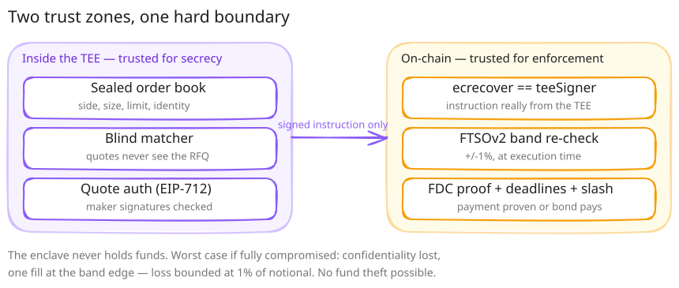

# Trust Model

WhisperDesk splits trust deliberately: the enclave is trusted for **secrecy only** — it never holds
funds. Every settlement rule that matters is enforced onchain regardless of what the enclave does or
claims.

## 1. What runs private, inside the TEE

The Flare Confidential Compute (FCE) enclave holds the sensitive parts of a trade and nothing else:

- **Sealed order book.** RFQ side, size, limit price, and the identity↔order mapping of the
  unmatched book exist only inside the enclave.
- **Blind matcher.** The deterministic matching rule runs over that sealed data in-enclave — a
  maker quoting against a sealed RFQ cannot read it.
- **EIP-712 quote authentication.** A maker's quote is authenticated inside the enclave by EIP-712
  before it can be matched against a sealed RFQ.

This data is **RAM-only** — it never lands in a database, never gets logged, and never touches the
demo's backend (which only stores public data: aggregate tape, settlement-tracker cache, proof
status). The enclave emits exactly one artifact to the outside world: a signed `MatchInstruction`
(`WD_MATCH_V1`).

## 2. What the chain verifies

`DvPEscrow` on Coston2 does not trust the enclave's output — it re-derives or re-checks every part
that matters before money moves:

| Check | Enforced at | What it prevents |
|---|---|---|
| `ecrecover == teeSigner` | `lock()` | A `MatchInstruction` not signed by the registered enclave key is rejected outright. |
| FTSOv2 ±1% band re-check, drops derived onchain | `lock()` | The enclave cannot mismatch price even if it lies — the contract recomputes the band itself. |
| FDC `XRPPayment` proof bound to `proofOwner == address(this)` | `release()` | A proof for one trade can never be replayed against another escrow instance. |
| Deadlines | `lock()` / `refund()` | Bounds how long a maker has to pay before the default path opens. |
| 1% maker bond, posted via `BondLedger` at match time | `lock()` | Slashed to the taker if the maker never pays; `refund()` is permissionless after `refundAfter + REFUND_GRACE`. |

The enclave is trusted for secrecy; the chain is trusted for custody. Neither side is trusted for
the other's job.

## 3. Stated assumptions

- **Simulated-TEE attestation.** The live enclave (`https://fce.endpx.cloud/info`) returns
  attestation `magic_pass` with `SIMULATED_TEE=true` — the mode Flare states is eligible for
  judging, not GCP Confidential Space hardware attestation. The cost of that choice: no hardware
  attestation, and the enclave's identity key **regenerates on every restart by design**.
  `scripts/enclave-loop/monitor.mjs` runs as a cron healthcheck specifically to watch for that key
  rotation, alongside asserting the escrow trusts the running enclave's key, the registry routes
  instructions to it, and its machine status is `PRODUCTION`.
- **MockFXRP in the interactive demo.** The public one-click demo settles a mintable, unbacked
  MockFXRP test token (`0x700bfC3620585eb42F1Dda6aBA3Ac8E793859FBE`), because the demo faucet has
  to hand every visitor FXRP and the real asset cannot be conjured per visitor. The mechanism itself
  is not mock-bound: one full settlement has also run against the real FAssets-minted FXRP
  (`AssetManagerFXRP.fAsset()` =
  [`0x0b6A3645…3dc7`](https://coston2-explorer.flare.network/address/0x0b6A3645c240605887a5532109323A3E12273dc7))
  on a separate escrow instance, using a v1.3 direct mint acquired the way the protocol intends —
  see the receipts on the [Overview](README.md) page.
- **One `teeSigner` key per escrow instance.** Each `DvPEscrow` deployment trusts exactly one
  signing key (e.g. the public-demo escrow `0x5f32783D…CFB9B` vs. the enclave-loop escrow
  `0x20A885cb…7023`, whose `teeSigner` is the live enclave). Trust is scoped per instance, not
  global — an instance's owner controls who its `teeSigner` is.

## Worst case

If the enclave is **fully compromised**: order-flow confidentiality is lost, and a match can be
steered to land at the edge of the FTSOv2 price band. It still cannot move a token outside the
rules above — **loss is bounded at 1% of notional, and no fund theft is possible.**
